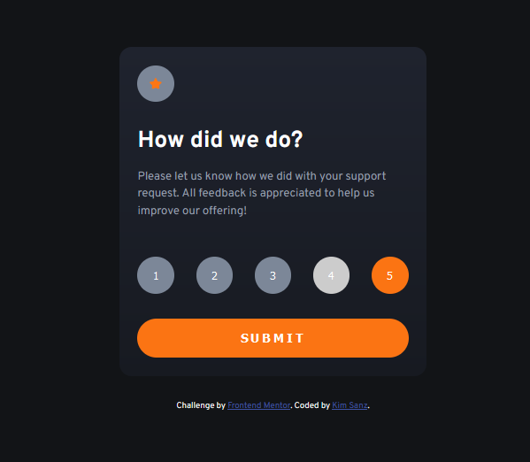
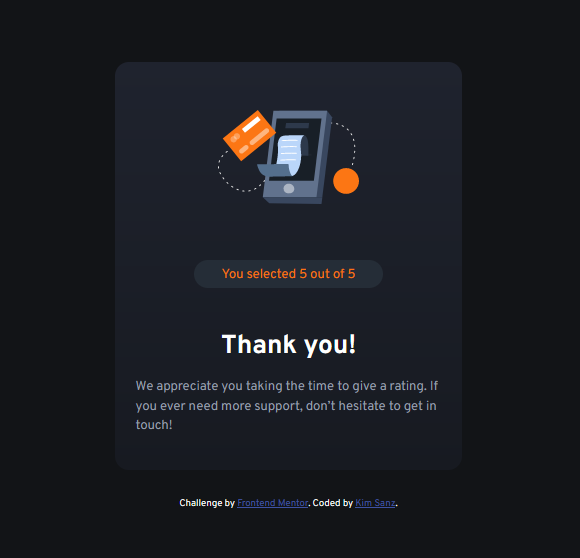

# Frontend Mentor - Interactive rating component solution

This is a solution to the [Interactive rating component challenge on Frontend Mentor](https://www.frontendmentor.io/challenges/interactive-rating-component-koxpeBUmI). Frontend Mentor challenges help you improve your coding skills by building realistic projects.

## Table of contents

- [Overview](#overview)
  - [The challenge](#the-challenge)
  - [Screenshot](#screenshot)
  - [Links](#links)
- [My process](#my-process)
  - [Built with](#built-with)
  - [What I learned](#what-i-learned)
  - [Useful resources](#useful-resources)
- [Author](#author)

## Overview

### The challenge

Users should be able to:

- View the optimal layout for the app depending on their device's screen size
- See hover states for all interactive elements on the page
- Select and submit a number rating
- See the "Thank you" card state after submitting a rating

### Screenshot

### Links

- Live Site URL: [Interactive Rating Component](https://frontendmentor-interactive-rating-component-ecru.vercel.app)

## My process

### Built with

- Semantic HTML5 markup
- CSS
- Flexbox
- Vanilla JS

### What I learned

Learned about Flexbox its properties and uses.
I noticed the main div containers was made with a gradient so I did a bit of research.
Had a hiccup on getting multiple innerHtml values and assigning it on a variable--learned array foreach method.
Learned a little about arrow functions.

### Useful resources

- [w3schools](https://w3schools.com) - A bit easier to digest as it has editable examples.
- [MDN](https://developer.mozilla.org/en-US/docs/Web/CSS) - Great reference for learning.

## Author

- Frontend Mentor - [@uepzues](https://www.frontendmentor.io/profile/uepsuez)
